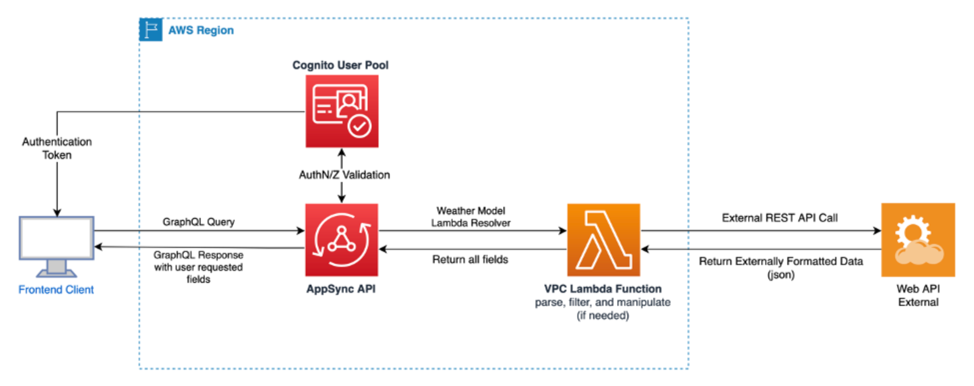

# AngularAmplify

## Init
```shell
npx create-nx-workspace@19 angular-amplify --preset=angular-monorepo
```

## Run tasks

To run the dev server for your app, use:

```shell
npx nx serve angular-amplify-app
```

To create a production bundle:

```shell
npx nx build angular-amplify-app
```

## Add AWS Amplify gen 2 https://docs.amplify.aws/angular/
```shell
npm install eslint@8.57.1
npm install aws-amplify @aws-amplify/ui-angular
npm install -g @aws-amplify/cli
npm create amplify@latest
```

```Add to styles
"node_modules/@aws-amplify/ui-angular/theme.css"
```

### Use cloud sandbox in dev environment after update amplify source code https://docs.amplify.aws/angular/start/account-setup/
```shell
npx ampx sandbox --once
```
OR
```shell
npx ampx sandbox --profile <profile-name>
```
```Terminating a sandbox environment
npx ampx sandbox delete --name <sandbox-name>
```

## Add boostrap 5
```shell
npm i bootstrap@5
```

```Add to styles
"node_modules/bootstrap/dist/css/bootstrap.min.css"
```
